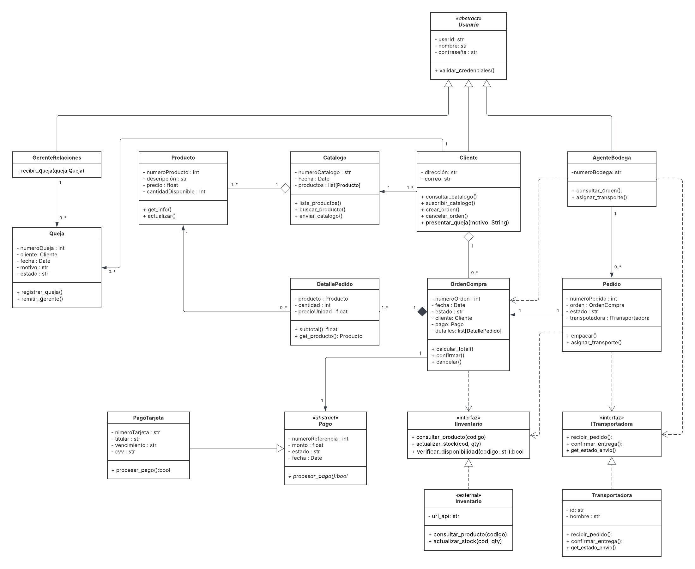
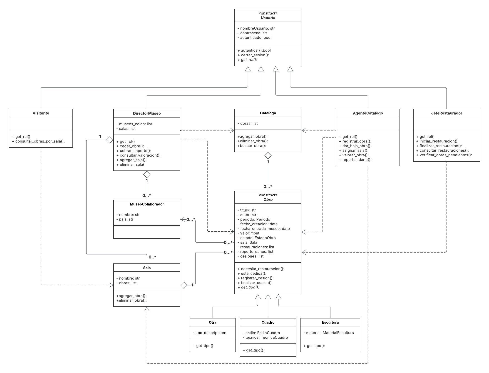

# Manual de Programación — Lenguaje II

**Autor:** Eduardo Coa  
**Repositorio:** [Eduardo-Coa/Lenguaje-II](https://github.com/Eduardo-Coa/Lenguaje-II)  
**Rama principal de trabajo:** `develop_dcoa37`

---

## Tabla de Contenidos

1. [Descripción General](#1-descripción-general)
2. [Principios SOLID Aplicados](#2-principios-solid-aplicados)
3. [Estructura del Proyecto](#3-estructura-del-proyecto)
4. [Estándares y Convenciones](#4-estándares-y-convenciones)
5. [Sistema TeleVentas](#5-sistema-televentas)
   - 5.1 [Python](#51-python)
   - 5.2 [Java](#52-java)
6. [Sistema Museo](#6-sistema-museo)
   - 6.1 [Python](#61-python)
   - 6.2 [Java](#62-java)
7. [Versiones Utilizadas](#7-versiones-utilizadas)
8. [Estructura de Ramas Git](#8-estructura-de-ramas-git)

---

## 1. Descripción General

El proyecto implementa dos sistemas orientados a objetos, cada uno desarrollado primero en **Python** y luego en **Java**:

| Sistema | Descripción |
|---|---|
| **TeleVentas** | Gestión de ventas por televisión: usuarios, productos, órdenes, pagos, pedidos y quejas. |
| **Museo** | Gestión de un museo: obras de arte, salas, restauraciones, cesiones y catálogo. |

Ambos sistemas aplican los principios **SOLID**, herencia, clases abstractas e interfaces.

---

## 2. Principios SOLID Aplicados

### S — Single Responsibility (Responsabilidad Única)
Cada clase tiene una única razón para cambiar.

| Clase | Responsabilidad única |
|---|---|
| `Producto` | Solo gestiona datos y validaciones del producto (precio, stock). |
| `DetallePedido` | Solo captura el precio unitario al momento de la compra y calcula su subtotal. |
| `Queja` | Solo registra y cambia el estado de una queja. |
| `Sala` | Solo agrupa obras físicamente dentro del museo. |
| `MuseoColaborador` | Solo representa un museo externo para cesiones. |
| `Catalogo` (ambos sistemas) | Solo gestiona la colección de elementos (productos u obras) y sus búsquedas. |

### O — Open/Closed (Abierto/Cerrado)
Las clases están abiertas para extensión pero cerradas para modificación.

- **`Pago`** es abstracta: se puede agregar `PagoEfectivo`, `PagoTransferencia`, etc. sin modificar la clase base ni las clases que la usan.
- **`Obra`** es abstracta: se pueden agregar nuevos tipos de obra (ej. `Fotografia`) extendiendo `Obra` sin tocar `Catalogo`, `Sala` ni `AgenteCatalogo`.
- **`Usuario`** (Museo) es abstracta: agregar un nuevo rol solo requiere crear una subclase nueva.

### L — Liskov Substitution (Sustitución de Liskov)
Las subclases pueden usarse donde se espera la clase base sin romper el comportamiento.

- `Cuadro`, `Escultura` y `Otra` son intercambiables como `Obra` en `Catalogo`, `Sala` y `AgenteCatalogo`. Todos implementan `obtenerTipo()` y heredan los mismos atributos y métodos.
- `PagoTarjeta` puede usarse en cualquier lugar donde se espere un `Pago`, ya que implementa `procesarPago()` correctamente.
- `Cliente`, `AgenteBodega` y `GerenteRelaciones` son intercambiables como `Usuario` en TeleVentas.

### I — Interface Segregation (Segregación de Interfaces)
Las interfaces son pequeñas y específicas; ninguna clase está forzada a implementar métodos que no necesita.

- **`ITransportadora`** solo define los métodos propios del transporte: `recibirPedido()`, `confirmarEntrega()`, `getEstadoEnvio()`.
- **`IInventario`** solo define los métodos del inventario: `consultarProducto()`, `actualizarStock()`, `verificarDisponibilidad()`.
- Estas interfaces no se mezclaron en una sola, porque `Transportadora` e `Inventario` tienen responsabilidades completamente distintas.

### D — Dependency Inversion (Inversión de Dependencias)
Los módulos de alto nivel dependen de abstracciones, no de implementaciones concretas.

- `AgenteBodega.asignarTransporte()` recibe una `ITransportadora` como parámetro, no una `Transportadora` concreta. Esto permite cambiar la implementación de transporte sin modificar `AgenteBodega`.
- `AgenteCatalogo` opera sobre `Obra` (abstracta), no sobre `Cuadro` ni `Escultura`. Así puede registrar, valorar y reportar daños en cualquier tipo de obra sin conocer su tipo específico.
- `DirectorMuseo.cederObra()` trabaja con `Obra` y `MuseoColaborador` como tipos generales, desacoplándose de las implementaciones concretas.

---

## 3. Estructura del Proyecto

```
Lenguaje II/
├── 1.1TeleVentas_Python/
│   ├── Clases/
│   │   ├── Usuario.py
│   │   ├── Cliente.py
│   │   ├── Producto.py
│   │   ├── Queja.py
│   │   ├── OrdenCompra.py
│   │   ├── Pedido.py
│   │   ├── DetallePedido.py
│   │   ├── Pago.py
│   │   ├── PagoTarjeta.py
│   │   ├── Transportadora.py
│   │   ├── Catalogo.py
│   │   ├── GerenteRelaciones.py
│   │   ├── AgenteBodega.py
│   │   └── Inventario.py
│   ├── Interfaces/
│   │   ├── IInvetario.py
│   │   └── ITransportadora.py
│   └── main.py
│
├── 1.2Museo_Python/
│   └── Clases/
│       ├── Usuario.py
│       ├── Obra.py
│       ├── Cuadro.py
│       ├── Escultura.py
│       ├── Otra.py
│       ├── Sala.py
│       ├── MuseoColaborador.py
│       ├── Catalogo.py
│       ├── Visitante.py
│       ├── AgenteCatalogo.py
│       ├── AgenteRestaurador.py
│       └── DirectorMuseo.py
│
├── 2.1Televentas_Java/
│   ├── ClasesTeleventas/
│   │   ├── Usuario.java
│   │   ├── Cliente.java
│   │   ├── Producto.java
│   │   ├── Queja.java
│   │   ├── OrdenCompra.java
│   │   ├── Pedido.java
│   │   ├── DetallePedido.java
│   │   ├── Pago.java
│   │   ├── PagoTarjeta.java
│   │   ├── Transportadora.java
│   │   ├── Catalogo.java
│   │   ├── GerenteRelaciones.java
│   │   ├── AgenteBodega.java
│   │   └── Inventario.javay
│   ├── Interfaces/
│   │   ├── IInventario.java
│   │   └── ITransportadora.java
│   └── Main.java
│
├── 2.2Museo_Java/
│   └── Clases_Museo/
│       ├── Usuario.java
│       ├── Obra.java
│       ├── Cuadro.java
│       ├── Escultura.java
│       ├── Otra.java
│       ├── Sala.java
│       ├── MuseoColaborador.java
│       ├── Catalogo.java
│       ├── Visitante.java
│       ├── AgenteCatalogo.java
│       ├── AgenteRestaurador.java
│       └── DirectorMuseo.java
```

---

## 4. Estándares y Convenciones

### Python
- **PEP 8:** nombres en `snake_case` para métodos y atributos; `PascalCase` para clases.
- **PEP 257:** docstrings en cada clase y método con formato de una línea o multilínea.
- **Atributos protegidos:** prefijo `_` (ej. `self._nombre`).
- **Propiedades:** `@property` para getters; `@setter` para setters con validación.
- **Clases abstractas:** `ABC` + `@abstractmethod` del módulo `abc`.
- **Enumeraciones:** `Enum` del módulo `enum`.
- **Fechas:** `date` del módulo `datetime`.

### Java
- **Javadoc:** `/** */` en cada clase y método; `@param` y `@return` obligatorios.
- **Convenciones:** `camelCase` para métodos y atributos; `PascalCase` para clases.
- **Encapsulamiento:** atributos `private`; acceso mediante getters/setters públicos.
- **Clases abstractas:** `abstract class`.
- **Interfaces:** `interface` con métodos sin implementación.
- **Enumeraciones:** `enum` definido dentro de la clase que lo usa.
- **Colecciones:** `List<T>` con `ArrayList`; `Map<K,V>` con `HashMap`.
- **Fechas:** `LocalDate` del paquete `java.time`.
- **Validaciones:** `throw new IllegalArgumentException(...)`.
- **Sin herramienta de construcción:** compilación directa con `javac`.

---

## 5. Sistema TeleVentas

## Diagrama UML



### 5.1 Python

**Paquete:** `1.1TeleVentas_Python/Clases/`

#### Jerarquía de Clases

```
Usuario (base)
├── Cliente
├── AgenteBodega
└── GerenteRelaciones

Pago (abstracta)
└── PagoTarjeta
```

#### Descripción de Clases

| Clase | Responsabilidad |
|---|---|
| `Usuario` | Clase base con autenticación (`autenticar()`, `cerrar_sesion()`). |
| `Cliente` | Crea órdenes, cancela órdenes y presenta quejas. |
| `Producto` | Almacena precio y cantidad disponible con validaciones. |
| `Queja` | Registra quejas con estados: `REGISTRADA`, `EN_REVISION`, `RESUELTA`, `CERRADA`. |
| `OrdenCompra` | Agrupa detalles de pedido; calcula total; puede confirmarse o cancelarse. |
| `Pedido` | Representa el envío físico; estados: `PENDIENTE`, `EMPACADO`, `TRANSPORTE_ASIGNADO`, `EN_DESPACHO`. |
| `DetallePedido` | Captura precio unitario en el momento de la compra y calcula subtotal. |
| `Pago` | Clase abstracta con método `procesar_pago()` que deben implementar las subclases. |
| `PagoTarjeta` | Valida número de tarjeta (solo dígitos) y procesa el pago. |
| `Transportadora` | Recibe pedidos y confirma entregas; maneja estados de envío. |
| `Catalogo` | Almacena productos y permite búsqueda por nombre (insensible a mayúsculas). |
| `GerenteRelaciones` | Recibe quejas desde el cliente y gestiona su resolución. |
| `AgenteBodega` | Consulta órdenes y asigna transportadoras a pedidos. |
| `Inventario` | Registra productos con stock; verifica disponibilidad por cantidad. |

#### Interfaces

| Interfaz | Métodos |
|---|---|
| `ITransportadora` | `recibir_pedido()`, `confirmar_entrega()`, `get_estado_envio()` |
| `IInventario` | `consultar_producto()`, `actualizar_stock()`, `verificar_disponibilidad()` |

#### Visualización de Pruebas

**Usuarios**
```
Bienvenido al sistema TeleVentas
  ----------------------------------------------------
  Usuario              Rol                Contraseña
  ----------------------------------------------------
  cli01                Cliente            pass123
  age01                Agente Bodega      agent123
  ger01                Gerente            ger123
  ----------------------------------------------------
```

**Cliente**
```
=======================================================
  TELEVENTAS — Inicio de sesión
=======================================================
  Usuario    : cli01
  Contraseña : pass123

  Bienvenido/a, Eduardo Coa.

=======================================================
  MENÚ CLIENTE — Eduardo Coa
=======================================================
  1. Consultar catálogo
  2. Suscribirse al catálogo
  3. Buscar producto
  4. Crear orden de compra
  5. Cancelar una orden
  6. Presentar una queja
  0. Cerrar sesión

  Opción: 1

=======================================================
  CATÁLOGO DE PRODUCTOS
=======================================================
  [101] Ferrari  —  $   90,000.00  (stock: 10)
  [102] Lamborghini  —  $   50,000.00  (stock: 50)
  [103] Porsche  —  $   80,000.00  (stock: 25)

Opción: 4

=======================================================
  CREAR ORDEN DE COMPRA
=======================================================
  [101] Ferrari  —  $   90,000.00
  [102] Lamborghini  —  $   50,000.00
  [103] Porsche  —  $   80,000.00

  Código del producto (0 para terminar): 1
  Producto no encontrado.

  Código del producto (0 para terminar): 101
  Cantidad de 'Ferrari': 2

  Código del producto (0 para terminar): 0

-- Resumen de la orden --
  [101] Ferrari  x2  —  $180,000.00
  TOTAL: $180,000.00

=======================================================
  DATOS DE PAGO — Tarjeta de crédito
=======================================================
  Número de tarjeta (16 dígitos): 1234567891123456
  Titular             : eduardo coa
  Vencimiento (MM/AA) : 05/28
  CVV (3 dígitos)     : 123
Pago aprobado. Tarjeta **** **** **** 3456 — monto $180,000.00
Orden 1001 confirmada con éxito.

  ORDEN # 1001
  fecha   : 2026-04-05
  estado  : confirmada
  cliente : Eduardo Coa
  total   : $180,000.00
  detalle :
    [101] Ferrari  x2  —  $180,000.00

  Orden pagada exitosamente.


Opción: 6

=======================================================
  REGISTRAR QUEJA
=======================================================
  Número de orden: 1001
  Motivo de la queja: El pedido lleva atrasado 1 semana, lo necesito urgente
Queja registrada, Cliente: Eduardo Coa.
Queja # 1 registrada.

Queja #1 remitida al gerente.
  Cliente: Eduardo Coa.


QUEJA # 1
  fecha  : 2026-04-05
  motivo : El pedido lleva atrasado 1 semana, lo necesito urgente
  estado : en_revision
  cliente: Eduardo Coa

```
**Agente Bodega**

```
=======================================================
  TELEVENTAS — Inicio de sesión
=======================================================
  Usuario    : age01
  Contraseña : agent123

  Bienvenido/a, Pedro Martínez.

=======================================================
  MENÚ AGENTE DE BODEGA — Pedro Martínez
=======================================================
  1. Ver órdenes confirmadas
  2. Empacar pedido
  3. Asignar transporte a pedido empacado
  0. Cerrar sesión

  Opción: 1

=======================================================
  ÓRDENES CONFIRMADAS
=======================================================
  [1001] cliente=Eduardo Coa  total=$190,000.00

  Número de orden a consultar (0 para volver): 1001
  - Ferrari | Cantidad: 1 | Subtotal: $90000.00
  - Lamborghini | Cantidad: 2 | Subtotal: $100000.00
  Total: $190000.00


  Opción: 2

=======================================================
  ÓRDENES LISTAS PARA EMPACAR
=======================================================
  [1001] cliente=Eduardo Coa

  Número de orden a empacar: 1001
Stock actualizado — producto 101: 10 → 9
Stock actualizado — producto 102: 50 → 48
Pedido 5001 empacado. Productos: 2
  PEDIDO # 5001
  estado : empacado
  orden  : 1001
  envio  : sin asignar


  Opción: 3

=======================================================
  PEDIDOS EMPACADOS
=======================================================
  [5001] orden=1001  cliente=Eduardo Coa

  Número de pedido a despachar: 5001
Agente Pedro Martínez asignando transporte al pedido 5001.
Transportadora asignada al pedido 5001.
Transportadora TransRápido S.A. recibió el pedido 5001.
Pedido en camino con TransRápido S.A..
Pedido 5001 en despacho.
  PEDIDO # 5001
  estado : en_despacho
  orden  : 1001
  envio  : en_camino

```
---

**Gerete Relaciones**

```
=======================================================
  TELEVENTAS — Inicio de sesión
=======================================================
  Usuario    : ger01
  Contraseña : ger123

  Bienvenido/a, Diunis Pérez.

=======================================================
  MENÚ GERENTE — Diunis Pérez
=======================================================
  1. Ver quejas recibidas
  0. Cerrar sesión

  Opción: 1

=======================================================
  QUEJAS RECIBIDAS
=======================================================
  QUEJA # 1
  fecha  : 2026-04-05
  motivo : El pedido llegó con retraso de 3 días.
  estado : en_revision
  cliente: Eduardo Coa

```

### 5.2 Java

**Paquete:** `ClasesTeleventas` — carpeta `2.1Televentas_Java/ClasesTeleventas/`

#### Diferencias respecto a Python

| Python | Java |
|---|---|
| `ABC` + `@abstractmethod` | `abstract class` |
| `@property` / `@setter` | `getX()` / `setX()` |
| `list` | `List<T>` con `ArrayList` |
| `dict` | `Map<K,V>` con `HashMap` |
| `raise ValueError` | `throw new IllegalArgumentException` |
| `date.today()` | `LocalDate.now()` |
| `__str__` | `toString()` con `@Override` |
| Constantes de clase `str` | `public static final String` |


#### Interfaces Java

```java
// package Interfaces;
interface ITransportadora {
    void recibirPedido(Pedido pedido);
    void confirmarEntrega();
    String getEstadoEnvio();
}

interface IInventario {
    Map<String, Object> consultarProducto(int idProducto);
    void actualizarStock(int idProducto, int cantidad);
    boolean verificarDisponibilidad(int idProducto, int cantidad);
}
```

---

## 6. Sistema Museo



### 6.1 Python

**Paquete:** `1.2Museo_Python/Clases/`

#### Jerarquía de Clases

```
Usuario (abstracta)
├── Visitante
├── AgenteCatalogo
├── AgenteRestaurador
└── DirectorMuseo

Obra (abstracta)
├── Cuadro
├── Escultura
└── Otra
```

#### Descripción de Clases

| Clase | Responsabilidad |
|---|---|
| `Usuario` | Clase base abstracta con `autenticar()`, `cerrar_sesion()` y `get_rol()` abstracto. |
| `Obra` | Clase base abstracta para obras; incluye enums `Periodo` y `EstadoObra`. |
| `Cuadro` | Obra pictórica con `EstiloCuadro` y `TecnicaCuadro`. |
| `Escultura` | Obra tridimensional con `MaterialEscultura` (mármol, bronce, madera, etc.). |
| `Otra` | Obra que no encaja en las categorías anteriores; tiene descripción libre. |
| `Sala` | Agrupa obras; permite agregar y retirar obras. |
| `MuseoColaborador` | Museo externo con el que se gestionan cesiones de obras. |
| `Catalogo` | Registra obras; permite búsqueda por autor, periodo, estado, sala y tipo. |
| `Visitante` | Puede consultar obras de una sala (ordenadas por título). |
| `AgenteCatalogo` | Registra/elimina obras, asigna salas, valora obras y reporta daños. |
| `AgenteRestaurador` | Inicia/finaliza restauraciones y verifica obras pendientes. |
| `DirectorMuseo` | Gestiona salas, museos colaboradores, cesiones y consulta valoración total. |

#### Enumeraciones

| Enum | Valores |
|---|---|
| `Periodo` | `RENACIMIENTO`, `BARROCO`, `ROCOCO`, `NEOCLASICISMO`, `ROMANTICISMO`, `REALISMO`, `IMPRESIONISMO`, `MODERNO_CONTEMPORANEO` |
| `EstadoObra` | `EXPUESTA`, `DANADA`, `EN_RESTAURACION`, `CEDIDA` |
| `EstiloCuadro` | `RENACIMIENTO`, `BARROCO`, `ROCOCO`, `NEOCLASICISMO`, `ROMANTICISMO`, `REALISMO`, `IMPRESIONISMO`, `POSTIMPRESIONISMO`, `EXPRESIONISMO`, `CUBISMO`, `SURREALISMO`, `POP_ART` |
| `TecnicaCuadro` | `FRESCO`, `TEMPERA`, `OLEO`, `ACUARELA`, `ACRILICO` |
| `MaterialEscultura` | `MARMOL`, `GRANITO`, `BRONCE`, `ORO`, `CONCRETO`, `MADERA` |

#### Visualización de Pruebas

**Usuarios**
```
  Bienvenido al sistema del Museo
  ----------------------------------------------------
  Usuario              Rol                    Contraseña
  ----------------------------------------------------
  visitante01          Visitante              vis123
  agente_cat01         Agente de Catálogo     admin123
  restaurador01        Agente Restaurador     rest456
  director01           Director del Museo     director789
  ----------------------------------------------------

```
**Visitante**
```
============================================================
  MENÚ VISITANTE — visitante01
============================================================
  1. Ver salas del museo
  2. Consultar obras por sala
  3. Buscar en catálogo
  0. Cerrar sesión

  Opción: 1

============================================================
  SALAS DEL MUSEO
============================================================

Sala 'Sala Renacimiento' (1 obras):
  - La Gioconda (Leonardo da Vinci)

Sala 'Sala Barroca' (1 obras):
  - Las Meninas (Diego Velázquez)

Sala 'Sala Impresionista' (2 obras):
  - La noche estrellada (Vincent van Gogh)
  - El pensador (Auguste Rodin)


  Opción: 3

============================================================
  BUSCAR EN CATÁLOGO
============================================================
  1. Por autor
  2. Por período
  3. Por tipo
  4. Por estado

  Opción: 2
  [1] Renacimiento (siglos XV-XVI)
  [2] Barroco (siglo XVII)
  [3] Rococó (siglo XVIII)
  [4] Neoclasicismo (siglos XVIII-XIX)
  [5] Romanticismo (siglo XIX)
  [6] Realismo (siglo XIX)
  [7] Impresionismo (finales del siglo XIX)
  [8] Arte Moderno y Contemporáneo (siglos XX-XXI)
  Período: 1

  Resultados (1):
  - Cuadro
 Titulo       : La Gioconda
 Autor        : Leonardo da Vinci
 Creación     : 1503-01-01
 Periodo      : Renacimiento (siglos XV-XVI)
 Estilo       : Renacimiento (s. XV-XVI)
 Técnica      : Pintura al Óleo
 Estado       : Expuesta
 Entrada museo: 1797-08-01
 Valoración   : 800000000.00 €

```
**Agente Catalogo**
```
============================================================
  MENÚ AGENTE CATÁLOGO — agente_cat01
============================================================
  1. Ver catálogo completo
  2. Registrar nueva obra
  3. Asignar obra a sala
  4. Reportar daño en obra
  5. Dar baja obra
  0. Cerrar sesión

  Opción: 2

============================================================
  REGISTRAR NUEVA OBRA
============================================================
  Tipo de obra:
  [1] Cuadro
  [2] Escultura
  [3] Otra

  Opción: 1
  Título       : el hombre de espaldas
  Autor        : eduardo coa

  Período histórico:
  [1] Renacimiento (siglos XV-XVI)
  [2] Barroco (siglo XVII)
  [3] Rococó (siglo XVIII)
  [4] Neoclasicismo (siglos XVIII-XIX)
  [5] Romanticismo (siglo XIX)
  [6] Realismo (siglo XIX)
  [7] Impresionismo (finales del siglo XIX)
  [8] Arte Moderno y Contemporáneo (siglos XX-XXI)
  Período: 8
  Fecha de creación (YYYY-MM-DD): 2018-05-06
  Fecha entrada al museo (YYYY-MM-DD): 2022-04-18

  Estilo artístico:
  [1] Renacimiento (s. XV-XVI)
  [2] Barroco (1600-1750)
  [3] Rococó (1720-1780)
  [4] Neoclasicismo (1750-1820)
  [5] Romanticismo (1790-1880)
  [6] Realismo (1840-1870)
  [7] Impresionismo (1872-1882)
  [8] Postimpresionismo (1880-1910)
  [9] Art Nouveau (1890-1905)
  [10] Fauvismo (1905-1908)
  [11] Expresionismo (1905-1933)
  [12] Cubismo (1907-1917)
  [13] Futurismo (1909-1920)
  [14] Dadaísmo (1916-1923)
  [15] Surrealismo (años 20-30)
  [16] Expresionismo Abstracto (1940s-50s)
  [17] Pop Art (1950s-60s)
  [18] Minimalismo (1960s)
  [19] Hiperrealismo (1970s-presente)
  [20] Arte Conceptual (1960s-presente)
  Estilo: 19

  Técnica:
  [1] Pintura al Fresco
  [2] Temple o Témpera
  [3] Pintura al Óleo
  [4] Encáustica
  [5] Acuarela
  [6] Acrílico
  Técnica: 6
  Valoración (€): 25000

  Obra registrada:
  Cuadro
 Titulo       : el hombre de espaldas
 Autor        : eduardo coa
 Creación     : 2018-05-06
 Periodo      : Arte Moderno y Contemporáneo (siglos XX-XXI)
 Estilo       : Hiperrealismo (1970s-presente)
 Técnica      : Acrílico
 Estado       : Expuesta
 Entrada museo: 2022-04-18
 Valoración   : 25000.00 €
```
**Agente Restaurador**
```
============================================================
  MUSEO — Inicio de sesión
============================================================
  Usuario    : restaurador01
  Contraseña : rest456

  Bienvenido/a, restaurador01  [Agente Restaurador].
  Bienvenido/a, restaurador01  [Agente Restaurador].

============================================================
  MENÚ RESTAURADOR — restaurador01
============================================================
  1. Ver obras pendientes de restauración
  2. Iniciar restauración
  3. Finalizar restauración
  4. Ver historial de restauraciones de una obra
  0. Cerrar sesión

  Opción: 1

============================================================
  OBRAS QUE NECESITAN RESTAURACIÓN
============================================================
  - 'La Gioconda'  (Leonardo da Vinci)  |  Estado: Expuesta
  - 'Las Meninas'  (Diego Velázquez)  |  Estado: Expuesta
  - 'La noche estrellada'  (Vincent van Gogh)  |  Estado: Expuesta
  - 'El pensador'  (Auguste Rodin)  |  Estado: Expuesta

============================================================
  MENÚ RESTAURADOR — restaurador01
============================================================
  1. Ver obras pendientes de restauración
  2. Iniciar restauración
  3. Finalizar restauración
  4. Ver historial de restauraciones de una obra
  0. Cerrar sesión

  Opción: 2

============================================================
  INICIAR RESTAURACIÓN
============================================================
  [1] Cuadro     'La Gioconda'  —  Leonardo da Vinci  |  Estado: Expuesta
  [2] Cuadro     'Las Meninas'  —  Diego Velázquez  |  Estado: Expuesta
  [3] Cuadro     'La noche estrellada'  —  Vincent van Gogh  |  Estado: Expuesta
  [4] Escultura  'El pensador'  —  Auguste Rodin  |  Estado: Expuesta

  Número de obra a restaurar (0 para cancelar): 2
  Restauración iniciada. Estado: En restauración

============================================================
  MENÚ RESTAURADOR — restaurador01
============================================================
  1. Ver obras pendientes de restauración
  2. Iniciar restauración
  3. Finalizar restauración
  4. Ver historial de restauraciones de una obra
  0. Cerrar sesión

  Opción: 4

============================================================
  HISTORIAL DE RESTAURACIONES
============================================================
  [1] Cuadro     'La Gioconda'  —  Leonardo da Vinci  |  Estado: Expuesta
  [2] Cuadro     'Las Meninas'  —  Diego Velázquez  |  Estado: En restauración
  [3] Cuadro     'La noche estrellada'  —  Vincent van Gogh  |  Estado: Expuesta
  [4] Escultura  'El pensador'  —  Auguste Rodin  |  Estado: Expuesta

  Número de obra a consultar (0 para cancelar): 1

  Restauraciones de 'La Gioconda':
    Inicio: 1956-06-01  —  Fin: 1956-09-15
    Inicio: 2004-03-10  —  Fin: 2004-07-20
```

**Director Museo**
```
============================================================
  MUSEO — Inicio de sesión
============================================================
  Usuario    : director01
  Contraseña : director789

  Bienvenido/a, director01  [Director del Museo].

============================================================
  MENÚ DIRECTOR — director01
============================================================
  1. Ver salas del museo
  2. Agregar sala
  3. Eliminar sala
  4. Ver museos colaboradores
  5. Agregar museo colaborador
  6. Ceder obra a museo colaborador
  7. Consultar valoración total del catálogo
  0. Cerrar sesión

  Opción: 1

============================================================
  SALAS DEL MUSEO
============================================================

Sala 'Sala Renacimiento' (1 obras):
  - La Gioconda (Leonardo da Vinci)

Sala 'Sala Barroca' (1 obras):
  - Las Meninas (Diego Velázquez)

Sala 'Sala Impresionista' (2 obras):
  - La noche estrellada (Vincent van Gogh)
  - El pensador (Auguste Rodin)


  Opción: 4

============================================================
  MUSEOS COLABORADORES
============================================================
  - Museo 'Musée d'Orsay' (Francia)


  Opción: 6

============================================================
  CEDER OBRA A MUSEO COLABORADOR
============================================================
  [1] Cuadro     'La Gioconda'  —  Leonardo da Vinci  |  Estado: Expuesta
  [2] Cuadro     'Las Meninas'  —  Diego Velázquez  |  Estado: Expuesta
  [3] Cuadro     'La noche estrellada'  —  Vincent van Gogh  |  Estado: Expuesta
  [4] Escultura  'El pensador'  —  Auguste Rodin  |  Estado: Expuesta

  Número de obra a ceder (0 para cancelar): 1

  Museo colaborador:
  [1] Museo 'Musée d'Orsay' (Francia)

  Número de museo (0 para cancelar): 1
  Importe de la cesión (€): 25000
  Fecha inicio de cesión (YYYY-MM-DD): 2026-04-05
  Fecha fin (YYYY-MM-DD, vacío = indefinida): 2027-07-05
  'La Gioconda' cedida a 'Musée d'Orsay'. Estado: Cedida
```
---

### 6.2 Java

**Paquete:** `Clases_Museo` — carpeta `2.2Museo_Java/Clases_Museo/`

#### Notas de implementación

- Los enums (`Periodo`, `EstadoObra`, `EstiloCuadro`, etc.) se definen **dentro** de la clase que los usa.
- `AgenteRestaurador` accede directamente a `obra.restauraciones` y `obra.estado` porque están en el mismo paquete (`protected`).
- `AgenteCatalogo.reportarDanio()` almacena el reporte como `Map<String, Object>` en `obra.reportesDanos`.
- `DirectorMuseo.cederObra()` recibe `LocalDate inicio` y `LocalDate fin` como parámetros separados (en Python era una tupla).

---

## 7. Versiones Utilizadas

- Python 3.13
- Java 21.0.8

---

## 8. Estructura de Ramas Git

```
main
└── develop
      └── develop_dcoa37   ← rama de trabajo principal
```

| Rama | Descripción |
|---|---|
| `main` | Rama de producción estable. |
| `develop` | Rama de integración. |
| `develop_dcoa37` | Rama personal de desarrollo. Todo el trabajo se realiza aquí. |